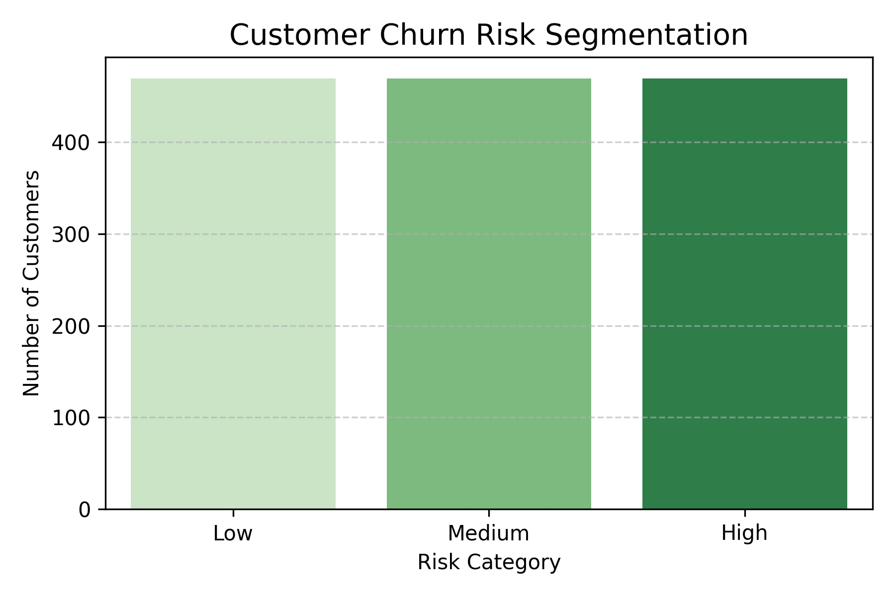
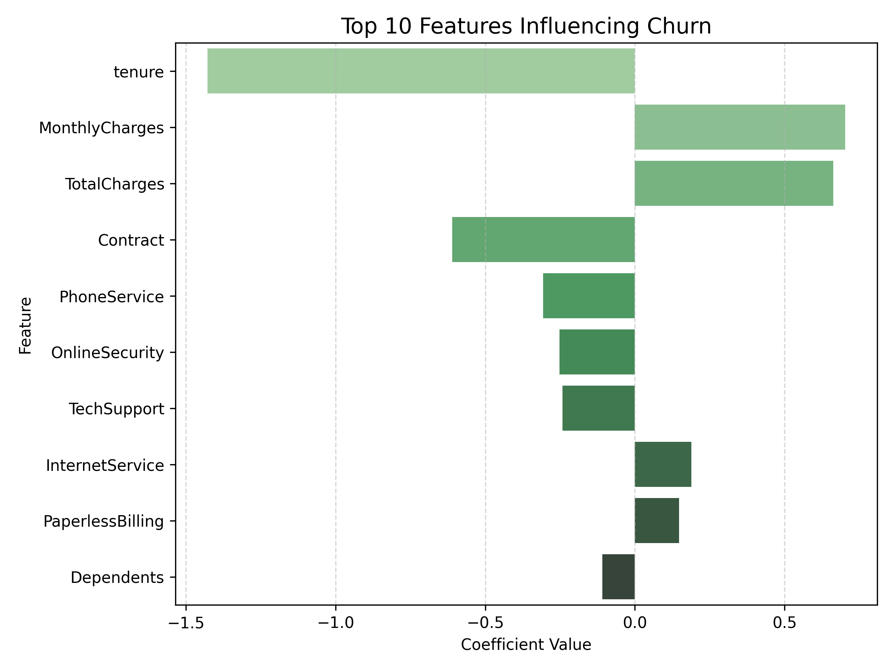

# 📊 Customer Churn Prediction – Logistic Regression Model

This project focuses on predicting customer churn in a telecom company using logistic regression. It goes beyond simple prediction by identifying high-risk customer segments, analyzing churn drivers, and offering actionable business recommendations.

---

## 🎯 Objective

To analyze customer behavior, identify key churn indicators, and predict which customers are likely to leave — enabling the business to implement targeted retention strategies.

---

## 🧾 Dataset

- **Source:** [Telco Customer Churn – Kaggle](https://www.kaggle.com/datasets/blastchar/telco-customer-churn)
- **Records:** 7,043
- **Target:** `Churn (Yes/No)`
- **Features:** Tenure, Contract Type, Monthly Charges, Payment Method, Internet Services, etc.

---

## 🔍 Key Highlights

- Built a logistic regression model with ~82% accuracy and AUC of 0.85
- Segmented customers into **Low**, **Medium**, and **High** churn risk tiers
- Identified **contract type, tenure, and payment method** as top churn predictors
- Generated business-friendly insights and suggested **retention strategies**
- Visualized findings using **green-themed charts** for professional dashboard-style reporting

---

## 📊 Visual Insights

  
📌 **Churn Risk Segmentation** – High-risk customers are mostly low-tenure users on month-to-month contracts.

  
📌 **Top Churn Drivers** – Contract type and tenure are the most influential features.

---

## 📈 Model Performance

- **Accuracy:** 82%
- **ROC AUC:** 0.85
- **Precision/Recall:** Balanced
- Evaluated using confusion matrix and ROC curve

---

## 💡 Business Recommendations

- Convert high-risk, month-to-month users to long-term plans
- Offer loyalty programs for customers with <12 months tenure
- Streamline payment experience for electronic check users

---

## 🛠 Tech Stack

- Python, Pandas, Scikit-learn, Matplotlib, Seaborn
- Logistic Regression
- Model Explainability
- Visual Reporting

---

## 📁 Project Structure

```
customer-churn/
├── churn_model.ipynb
├── churn_risk_segmentation.png
├── feature_importance.png
├── confusion_matrix.png
├── roc_curve.png
└── README.md
```

---

## 👩‍💻 Author

**Jahnavi P**  
📍 Bangalore, India  
📫 [jahnavip257@gmail.com](mailto:jahnavip257@gmail.com)  
🔗 [LinkedIn](https://www.linkedin.com/in/jahnavi-p-a68788233) 

---

